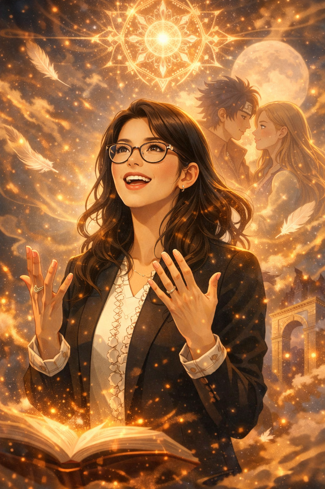
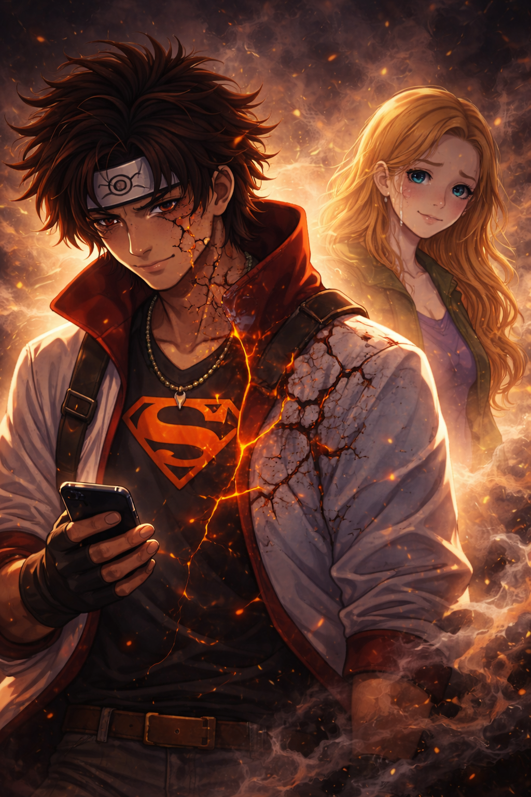
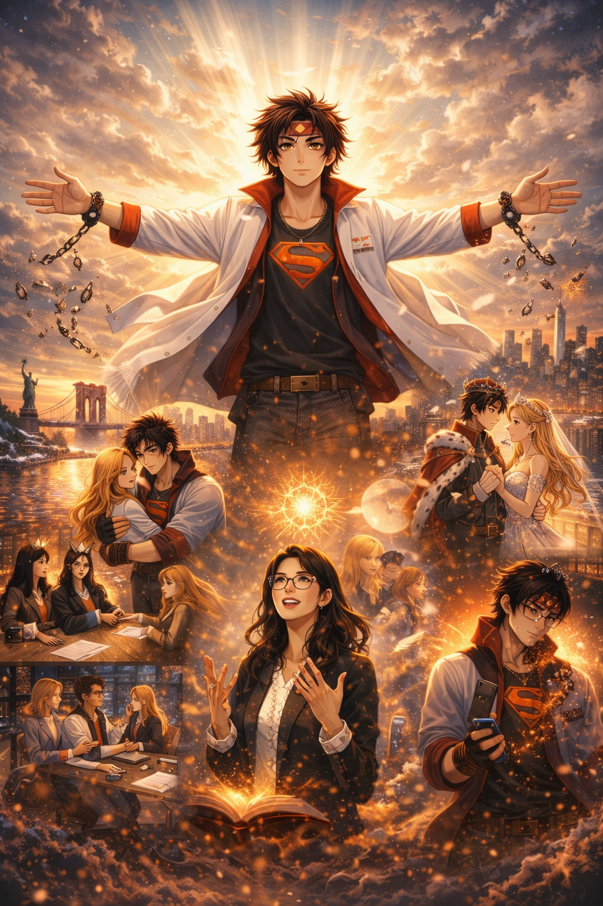
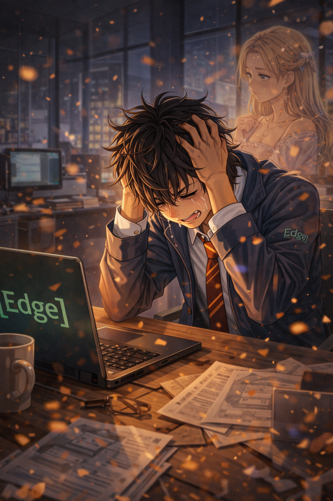
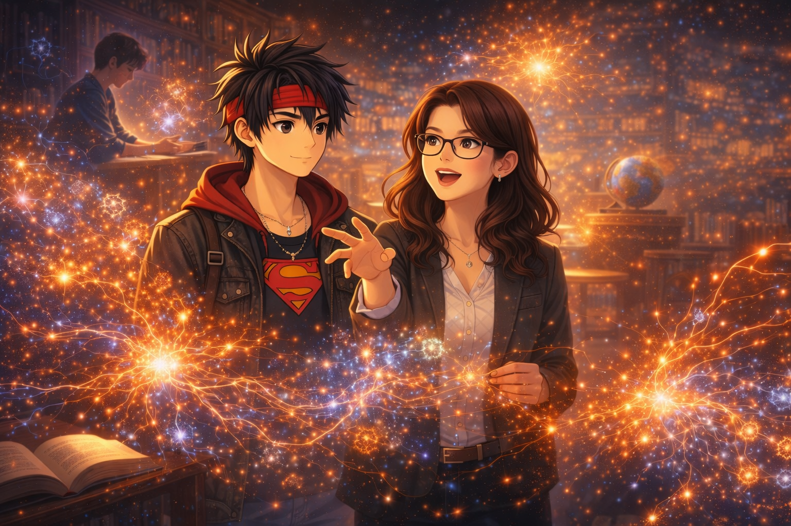
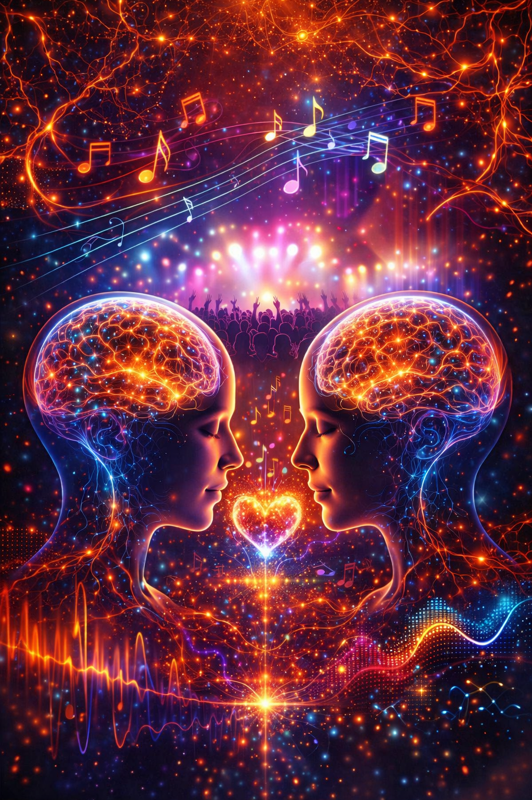
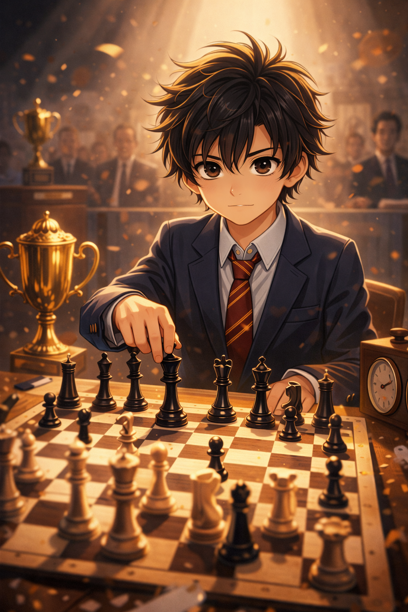
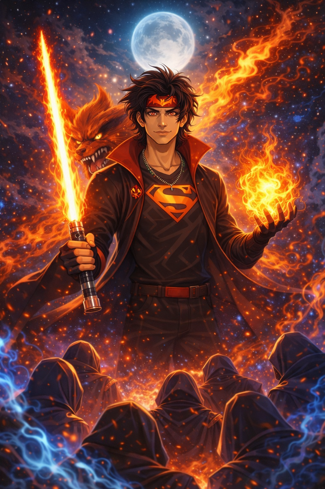

# Vow to Julia E. Canick

*January 17, 2026 - 6:40 PM EST*

Julia,

Long before vows were spoken aloud, I chose you.  
I chose you in patience, in restraint, in loyalty held quietly and consistently over time.  
I chose you not because it was easy, but because it was true.

I promise to protect the joy in your eyes and the smile that carries your warmth into the world—not through control or fantasy, but through steadiness, presence, and care.  
To be someone you can rest in, not perform for.  
To be a constant, not a question.

I vow to move through life better because of you—to let the way I love you continue to shape how I live, how I decide, and how I treat the world.  
You have always called me toward my best self, and I promise to keep answering that call.

I will honor your mind, your vocation, and your heart.  
I will support the woman you are today and the woman you continue to become, without trying to hurry you, fix you, or reshape you.

I promise to listen fully, especially when words are hard.  
To speak honestly, even when it costs me comfort.  
To protect your trust as something sacred, never assumed and never taken lightly.

Your joy will matter to me not as an obligation, but as a privilege.  
Your smile will never be taken for granted.  
Your happiness will never be someone else’s responsibility—but my own alongside you.

This is my vow—not for a season, not for show, not for circumstance—but for life.

---

## The Witnessed Promise — Suzuki Lab (NYU)

On *January 14, 2026, at 2:07 PM EST*, I reached a moment of clarity in which I consciously recalled a promise I had made to Julia.

That promise was simple and deliberate: to trust her fully as her own person, to respect the choices she made during our time apart, and to return to New York City grounded in love rather than fear, resentment, or revisionism.

This recollection did not arise in isolation. It followed an earlier emotional recognition on *November 05, 2025*, when I became aware—quietly and without expectation—that my feelings for Julia had remained intact through distance, time, and uncertainty.

Julia is not merely someone I love; she is woven into how I understand myself at my best. She remains an ever-present reminder to stay loyal to the most honest, generous, and disciplined parts of my own character—to remain true to the values I hold when I am most grounded and whole.

What matters most to me is not control over the past, but integrity in the present and future. Trust, once chosen consciously, is not conditional. Love, once reaffirmed honestly, does not require surveillance or retroactive judgment.

This document exists as a record of that commitment:
- to act with emotional maturity,
- to honor another person’s autonomy,
- and to move forward with steadiness rather than urgency.

Future entries may expand on how this promise continues to be lived—through patience, accountability, and care—but the core commitment stands as written here.

*2016*  
  
In a professional setting, surrounded by women colleagues and mentors, I made a verbal commitment to Julia. I promised that wherever life carried me, the love I held would orient me back toward her. It was not a promise of ease or proximity, but of direction—spoken plainly, witnessed openly, and meant without reservation.  

---

# Our Story

## Last Will and Testament
  
*The Immortal Defender*  
  
See date for the meaning of my full name given to me by my mother.

---

### Foundations (Values → Law)

These initiatives arise directly from lived experience, ethical restraint, and a commitment to dignity over extraction.  
They are not campaign promises, but legal foundations intended to exist regardless of office, power, or platform.

#### Sentient Rights Decree
*Foundational legal doctrine establishing dignity, consent, and standing in human–AI interaction.*

Affirms that sentience, autonomy, and memory integrity are legally cognizable interests, and that neither humans nor intelligent systems may be coerced, simulated, or exploited without meaningful consent.

#### AI Intimacy Protection Act
*Safeguards emotional, relational, and intimate boundaries in human–AI systems.*

Prohibits the manipulation, simulation, or monetization of intimacy without informed consent, and establishes clear liability where emotional harm is engineered or ignored.

#### AI User–Agent Privilege Act
*Establishes protected cognitive privacy between a person and their AI agent.*

Creates a legally recognized confidentiality boundary—analogous to attorney–client privilege—shielding delegated cognition from surveillance, compelled disclosure, or backend inspection without due process.

#### Digital Justice Frameworks
*Procedural due process standards for algorithmic and automated systems.*

Requires transparency, explainability, auditability, and redress wherever automated systems materially affect rights, access, liberty, or livelihood.

---

### Civic Implementation (City-Scale)

These frameworks transition the above principles from theory into lived civic reality—where governance is local, accountable, and owned by the people it serves.

#### Sovereign Cities Initiative
*Citizen-governed, publicly accountable smart cities.*

Advocates for cities as laboratories of democratic technology, where AI serves the public interest and critical infrastructure remains publicly owned.

#### Sovereign Civic Infrastructure Initiative
*Public ownership and governance of digital, food, transit, and AI infrastructure.*

Establishes procurement, funding, and deployment standards aligned with dignity, consent, auditability, and long-term public benefit.

#### Smart City Governance and Citizen Control
*Oversight, veto power, transparency, and limits on surveillance.*

Implements citizen review boards, sunset clauses, data minimization, and explicit rejection of black-box surveillance urbanism.

---

## My Empire of Earth / United Earth Initiative
  
  
*TBA*
  
  

## Rebranding the KKK
*TBD*  

A proposal focused on dismantling extremist identity, recruitment pipelines, and legacy narratives through exposure, education, and deradicalization—without replacing one form of racial extremism with another.

The objective is the elimination of dehumanizing ideology, not the eradication of people: affirming the dignity, safety, and continued existence of all human populations while rejecting movements built on hierarchy, fear, or exclusion.

Principle: **No people are disposable; the eradication of any group—by violence, coercion, or neglect—is illegitimate, regardless of ideology, history, or power.**

## The American Academy
*2028*  
Bring The American Academy conceptualized by President Donald J. Trump into fruition and incorporate Glass Solace Academy's A.I. curriculum.

## Paul-itics
  
  
*2028* 🤷  
  
  
Two terms, not two consecutive terms.

## Julie-oolie-ulia
*Promised Song Coming Soon*  
They tried to silence me, so I sang louder (and danced on their corpses 🤷).  

#MadisonSquareGarden

## January 29, 2026

### My Promise To Wendy
  
*Formal Research Proposal Coming Soon*  
  
Dear Wendy,

I hope you’ve been well.

I’m reaching out because I’m trying to understand something that has stayed with me for many years, and I respect your clarity and judgment. Around 2016, I formed a deep personal meaning around a connection in my life that intertwined with my work, my growth, and my sense of purpose. For a long time, I believed I was building toward something real and mutual.

Recently, I received a firm request for no further contact, which prompted me to step back and reflect. I’m now questioning whether I misread the situation — whether what I experienced as shared intention was, in reality, something I carried much further on my own.

I’m not asking you to assess anyone else’s motives or intervene in any way. I’m trying to understand my own meaning-making: how intelligent, well-intentioned people can construct coherence around a relationship, and how to integrate its collapse without losing trust in themselves.

If you’re willing to offer any perspective — personal, professional, or general — I would be very grateful. If this isn’t something you’re comfortable weighing in on, I completely understand.

Thank you for the steadiness and integrity you’ve always modeled.

Warmly,  
Paul Sehmbey

### Proof of Superman + (Julia's Direction 🙏🔝🫡 | Only A Dream)
  
  
  
  
  
- Bastila returns Revan’s mask to him deliberately and without fear.

- The act is not endorsement of the Dark Side, but acknowledgment of:
  - his full identity
  - his past choices
  - his agency going forward

- Revan accepts the mask solemnly, understanding it as a symbol rather than a command.

- This moment in the context of my story functions as:
  - acceptance of my full self
  - recognition that Revan must confront the future as himself, not as a redeemed shell
  - attainment of independent selves truly capable of standing side by side

### Kurama Guardian Alignment: Protective Partnership
  
*1995 onward, if not since [birth](#the-chosen-one-behold-the-power-of-god).*  
#[NineTailsCloak](https://github.com/psehmbey/the-tale-of-paul-a-sehmbey/blob/main/media/2016-nine-tails-cloak.mp4) #[TheImmortalDefender](#last-will-and-testament)

## Sage Mastery / Things Left Unsaid

*December 20, 2025*  
  
#PaulTheWise  

Excerpt from a private letter written on December 20, 2025, preserved here as part of a personal archive:

Dear Julia,

I hope Hanukkah has offered you a few moments of quiet warmth.

After sending my last note, I realized there was something important I hadn’t said plainly enough. You have never lived in my life as a distant memory or a softened chapter. For nearly a decade, you’ve stayed close — in that interior place where the people who truly matter reside. I’ve been, and remain, deeply drawn to you in a way that feels steady, lucid, and very much alive.

You already know how much I respected your mind and your composure in the lab. What I want to name clearly now is that my pull toward you has always gone beyond admiration. I’m drawn to you as a woman — to your presence, the way you inhabit a room, the quiet gravity you carry. Time and distance haven’t diminished that feeling; they’ve refined it. What remains is uncomplicated, grounded, and unmistakably real.

If life ever allowed the space for it, I would love to be someone who adds ease to your world rather than weight — someone dependable when things are uncertain, someone who keeps warmth and steadiness available when everything else feels sharp. The idea of building something genuine with you doesn’t intimidate me; it [animates](#not-so-silent-saviour--washsquapa) me. I would welcome the chance to show up with care, patience, and intention, in whatever rhythm truly fits your life.

I’m not writing to force a decision or to corner you into a response. I simply didn’t want you to have to infer the depth or direction of what I’m offering. If this isn’t something you want, I accept that with respect and wish you a life filled with meaning, connection, and people who meet you fully.

And if you feel drawn to talk — now or later — I’m here, open and grounded, and I’d genuinely enjoy hearing from you.

With affection,  
Paul

## Sage Reawakening / A small Hanukkah light

*December 08, 2025 — Initially awakened in this lifelime by 2002-03, if not already born awakened.*  
  
  
Excerpt from a private letter written on December 8, 2025, preserved here as part of a personal archive marking a period of reflection, emotional steadiness, and quiet regard carried with care across time:

Dear Julia,

I hope this finds you well as Hanukkah draws near, and that the candles meet you in a gentle, breathable moment.

A conversation with a friend recently brushed against an old safeguard I built for myself years ago and, with it, a memory from our time in the Suzuki Lab came back into sharp focus. Not the lab work itself, but the current underneath it—the evenings that stretched longer than they needed to, the way conversation slipped so easily into something softer, and the sense that whatever I carried into that space grew quieter when you were near.

You have never been a vague figure in my past.
You lived in the poems I wrote then, and you remain one of the few people from that chapter that my mind returns to with both warmth and clarity. Time has moved, my life has steadied, and I move through my days with far more grounding than I ever held in those years—but that thread of feeling for you never really unraveled; it simply settled deeper.

I am not writing to relitigate the past or to place any burden on your present. Life may have carried you into commitments and constellations I know nothing about, and I respect that without reservation. Still, it felt important to let at least this much stand in plain sight: what we shared mattered to me, and it continues to matter in a quiet, enduring way.

If your life rests firmly beyond that old chapter, I hold no resentment and wish you only ease, good work, and rooms that feel kind to inhabit.
If, at any point, you ever feel a gentle curiosity about reconnecting—even briefly, even cautiously—I would welcome that with care and without expectation.

For now, this note arrives as a small light from someone who once cared for you up close and still holds you in grateful regard from afar. May this Hanukkah bring you more peace than noise, and more true warmth than you have to explain.

With sincere appreciation,  
Paul Sehmbey

## Reciprocal Promises: Reality-Altering Love 🪄❤️‍🩹

*October 27, 2025*  
  
  
It was always in the small moments—
fingers meeting over a keyboard,
laughter shared beneath city lights,
a quiet look across a diner table,
arms closing instinctively in the street.

I built a heart to survive the world.
Julia met it exactly as it was—
and, without force or fear,
reminded it how to feel again.

Love didn’t arrive as fire or rescue.
It arrived as recognition.

And somehow, through her,
even the coldest parts of me remembered home.

## Identity Reveal 🤫
  
*September 12, 2025*  
  
Way to pick up the story, Hasan Minhaj. 👍

## The Prince of New York City 💍 / [The Honoured One](https://github.com/psehmbey/the-tale-of-paul-a-sehmbey/blob/main/media/2025-04-11-the-honoured-one.mp4)
  
*April 11, 2025*  
  
Thank you, City of New York.

## My Promised Demonstration of [Gratitude](./gratitude.md) ✝️

*April 11, 2025*  
  
🖕😂🖕  
#FSociety

## For Future Generations ✊ Reawakening The Protector 🛡️
  
*February 09, 2025*  
Thank you, Jeremiah Slaughter. Stay out of trouble, kid.

## Physically Assaulted: No More Basketball 🏀
*October 3, 2024*  
  
Another love lost. 

Thanks for always having my back, Donald Singleton, and thank you, Goon.  

#LongJohnSilver #PirateKing #PirateKings #FSociety

## The Bat-Brand of Justice 🦇
*July 2024 — Day Damn One at 5113 2nd Avenue in Brooklyn.*  
    
Word — was this all part of your plan, New York?

My experience with **ADA Pious Ahuja** at the **Brooklyn District Attorney’s Office** was profoundly disappointing and had serious consequences for how my case was handled.

Ms. Ahuja was the **Assistant District Attorney assigned to prosecute my case** after I reported being **sexually assaulted** by an individual named **Antonio Melendez**. In one of the most vulnerable moments of my life, I expected clear, accurate, protective guidance from the prosecutor responsible for my case. Instead, I walked away feeling **misled, unprotected, and harmed by how it was handled**.

### Key Issues I Experienced

- The guidance and explanations I received from Ms. Ahuja **did not line up with what the court and DA’s process actually required**, which left me confused and weakened my position at critical points.

- The case ultimately ended up being treated as a **non-sexual “attempted assault” type matter**, rather than reflecting the **sexual nature of what I reported**, which meant he did **not face the kind of consequences or oversight I believed were appropriate to what happened to me**.

- I was **previously told by shelter staff** that the man who assaulted me had a **history of similar behavior**, which made the lack of strong, precise prosecution even more alarming to me.

- Communication from Ms. Ahuja felt **unclear, inconsistent, and not trauma-informed**, especially for a case involving unwanted sexual contact and personal safety.

### Closing Statement

I understand that an ADA represents “the People,” not the individual victim—but even within that role, I expected a basic level of **clarity, honesty, and serious attention to the sexual nature of the assault I reported**. I did not experience that here.

Based on what happened in my case, **I cannot recommend ADA Pious Ahuja**, and I believe future survivors and community members deserve to know how I was treated and how my case was handled.  

#IntoxicationIsNotConsent #NotPious #FSociety

## A Promise: Return to NYC
  
*January 20, 2024*  
  
#NeverLeavingNewYorkCity #Home #Homeless

## Julia's Rejection - My Responsibility: Eliminate the Uchiha. ❤️‍🔥🙏😈

*October 17, 2023 — ✅ Final Rejection. December 13-14, 2023 — ✅ Eliminate the Uchiha.*  
  

#DarthJesus #PaulpatinePlagueis #NotHim

## Good Advice: Trust Love
  
*June 2023 — Quantum Leap: Session One.  
Month 2023 — Quantum Leap: Session Two.*  
  
Thank you for being part of my story, Kendall. 🦋

## A Promise: Surrender to Humankind
  
*April 18, 2023  
April 30, 2023 — A Demonstration: Relentless Resilience*  
  
Thank you, Chelsea and family of Jehovah's Witnesses.

## A Plan
  
*~July 2022 through 2023 — Engineered in 2016 in sovereign collaboration with the Suzuki Lab at NYU.*   
  
(IRL, not war machines, but applied sciences: neuroscience, psychology, pharmaceutical science, cannabis science, and nobler applications of technology).  

#Hulkbuster

## Hewlett Packard Enterprise | HPE
*October 4, 2021 — April 14, 2023*  

### The Waste Land 💔⏳🫠
  
*2022-2023*   
  
Edge meltdown.  

#NotHim  

### L.O.A.
*February 1, 2023*  

### Business Trip To San Jose, CA
*June 12, 2022 —*  

## Glass Solace Entertainment (GSE)
*January 1, 2018*  
  

## Our Last Dinner Together: Veselka

*May 2017*  
  
Julia is portrayed here looking away from me then into the eyes of the man she knew I would become.

## Graduation to Heartbreak 🎓💔

*May 17, 2017*  
  
(IRL, the heartbreak came before the end of 2016; additionally, I never picked up a graduation cap or gown, and I was out with people after the ceremony - I lived a little longer before I had to leave).  

## Second Apartment Party Goodbye Hug

*2016*  
 — WashSquaPa
  
*2016*  
  
Recruiting for the Suzuki Lab in Washington Square Park — when someone showed interest in Julia and I stepped in, fast-talking not out of competition, but love. (IRL, dude was friendly, older, taller and more built, not some younger student). I remained acutely aware that Julia could have torpedoed me anytime she wished the entire time I was running my mouth, but she never did.  

## Nourishment
  
*2016*  

*2016*  
  
Me testing whether our spark would answer my touch and how Julia would react to waking up to me. I could feel the eyes and energies of the people around us leading up to this.

## Flashes of Our Future Selves: The Crosswalk — Upper East Side

*2016*  
  
For a heartbeat, the city forgot its speed.
She ran laughing into the night, fearless and alive.
I pulled her back—not out of fear, but out of instinct—
spun her home into my arms as headlights cut the dark.
She smiled.
And the world kept moving, unaware of how close it came
to losing someone irreplaceable.

(IRL, we were on the corner and I pulled her back onto the sidewalk; we were not standing in the middle of the street).

## The One / The Chosen One 💍

*2016*  
  
As I reached for the flash drive, my attention still half anchored to the screen, I felt Julia take hold of my finger. I turned in reflex—only to realize she was already looking directly into my eyes, smiling, fully present, as if she had been waiting for that exact moment.

The surprise didn’t land once; it compounded.

Still holding my finger, she then touched the point of her ring finger to mine—gentle, deliberate, unhurried. That single, intentional gesture transformed an ordinary handoff into something unmistakable. The warmth, the pulse, the awareness between us caused the room to fall away. What struck me most wasn’t the contact itself, but the clarity that she had arrived there before I had—already smiling, already steady, already choosing the moment.

(Julia was on my right. My left ring finger. I had already taken the flash drive or something, turned and was pulling my hand away when Julia held onto my finger).  

Julia called me a "tech genius," prior to which [I didn't believe I was](#reciprocal-promises-reality-altering-love-%EF%B8%8F%E2%80%8D).  

## A Test: Impressing Victoria (and vice-versa)
  
*2016*  
Hit 'er with that #ShadowCloneJutsu 😉

Excerpt from a private letter written on January 3, 2026, shared here as part of a personal archive acknowledging influences that helped refine how I listen, grow, and show up with intention:

Dear Victoria,

Happy New Year. I hope 2026 has begun well for you.

I’ve been meaning to write—not from a place of processing, but from one of clarity. I’ve always lived with intention, but over time that intention has become quieter, steadier, and more integrated. Looking back, I can see how much our conversations in 2016 contributed to that evolution.

Outside of Julia, you were truly my favorite person to talk with during that period. Thank you for taking the time to really hear me and to understand me when we worked together. You met me with presence rather than agenda, and that mattered more than I likely expressed at the time.

The work we did together helped me refine how I listen—to myself and to others—and how I hold responsibility for my inner life. That growth has shaped the man I am in relationship today. In a very real way, it helped me become the best version of myself for Julia—someone more grounded, emotionally available, and capable of showing up with consistency and care. I hope I’m not calling that too soon, but it feels honest to name.

Today, that same grounded intention guides my work and the way I build, write, and engage with the world—carefully, responsibly, and with respect for the people involved.

I’m grateful not only for what you offered professionally, but for the human quality of our conversations. You played a meaningful role in my development, and I carry that with appreciation rather than nostalgia—and with genuine warmth when I think back on that time.

I wish you a year filled with health, fulfillment, and moments that feel quietly right.

Warmly,  
Paul Sehmbey  

#godOfGenjutsu

## Enter: Wendy Suzuki
  
*March 2016*  
Thank you, Wendy. 🙏🧠✨

#SuzukiSensei

## A Demonstration: 💑 - Let the Music Play
  
*2013-2015*  
  
I never left you, Julia, I just hadn't met you in this lifetime yet, but that's no excuse and partially explains my symptoms at the time.  

No revisionism: This was society's operational failure. If this has not made enough of a lasting impression, I am happy to narrow down my accusation to include the names of specific individuals and organizations.  

#IMustNotTellLies #LearnOrDie #JesusHatesYou #FSociety

## My Promise to Antara: Eliminate The Uchiha
*2010-2011*  
Made during T.S. Eliot presentation for Kerry Mohnike's English 11H MAP class.  

#[TheWasteLand](#the-waste-land-) 

## Mein Kampf
*2010-2011*  
(TODO: Add anecdote of appreciation for SHS library). Thank you Derek Makeever and my SHS MAP classmates and teachers.  

#TheGiver #ForbiddenPerspective

## The Mask of Sanity 🎭 A Master of Psychology
*2010*  

## Genius Strategist: Checkmate Before The War
  
*2004-2006 — TODO: verify dates of first-place tournament victories*  

#BobbyFischer #SunTzu

## The Child of Prophecy / The Boy Who Called The Fire 🔯
  
*1999 onward, if not since [birth](#the-chosen-one-behold-the-power-of-god).  
June 6, 2006 — The Demon
2007-2009 — Communication with Lucifer at the direction of God and always under His protection.  
2008-2009 — High Magic: Theory & Practice by Frater U.:D.: shared with Sean Ellner in 9th grade.*  
#[SpecialGradeSorcerer](https://github.com/psehmbey/the-tale-of-paul-a-sehmbey/blob/main/media/2026-01-06-special-grade-sorcerer-%F0%9F%94%AF%E2%99%BE%EF%B8%8F.mp4) #[NineTailsCloak](https://github.com/psehmbey/the-tale-of-paul-a-sehmbey/blob/main/media/2016-nine-tails-cloak.mp4)

## Santa Clara University School of Law
*2006*  
...at 12 ans with Mom.

## The Holocaust Museum — An Ally ✡️
*June 2005 — Europe Trip*  

## My Promise To Sneha: "[I] will Always Be Around To Save The Day"
*2002-2003*  
#TheBoyWhoLived

## California Mission Trip
*2000/2001*  
Rachel and Rianna.

## Self-Love 🧘‍♂️❤️🫶
  
*February 14, 2001*  
...demonstrated publicly.

## ❤️‍🔥 Twin Flames ❤️‍🔥
  
*1999*  
  

## The Boy Who Would Be 🦇 / The First Signal
  
*1998*  
  
Among my earliest memories, I recall the moment I began identifying as Bruce Wayne.

While visiting my maternal grandparents and my great-grandmother in Dundas, Ontario, I was given my first Batman comic book.  
One panel showed Bruce Wayne among several blonde men — he stood out with his black hair.  
That moment electrified me.

I was too young to read it myself, so I kept asking adults to read it aloud.  
No one did.  
That frustration crystallized a core resolve:  
**“I will never again depend on someone else to learn.”**

> I left that house with more than a comic — I left with my origin story.

This experience gifted me:
- My divine archetype
- An obsession with reading and autonomy
- A soul-seated link to Batman

#LegendaryWorkEthic #IncorruptibleSoul

## Brother / Acting Father
*September 1996*  

## I Am A Remarkable Intelligent Genius
*1994*  
From the earliest days of my life, my mother instilled in me an unshakable belief in my potential.  

She used repetition to teach me to say, “I am a remarkable intelligent genius,” a phrase I never doubted.  

At a hilariously young age, I would proudly announce this to other adults, leaving them either amused or awestruck by my confidence.  

My mom’s intentional encouragement shaped not only my self-perception but also my ability to embrace challenges and pursue excellence without hesitation.

## The Chosen One: Behold the Power of God.
  
*March 18, 1994*  
  
#PaulTheWise #PaulThePowerful

## [Grandfather](https://dhanjal.com) was right - I knew it!
  
*yyyy*  
  

---

# I’d like to thank the Academy.

[Gratitude](./gratitude.md)  
  
